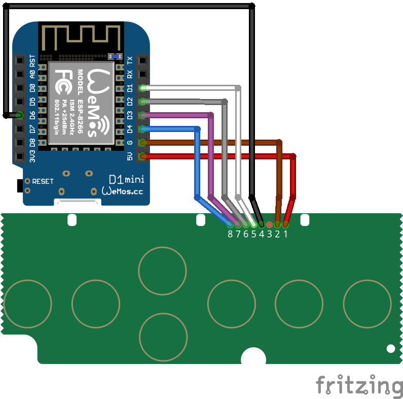

# Exeta Desk Controller

Remote control your [Exeta motorized desk](https://exeta.de/) over the network.

This works with an Arduino board reading the central control box signals and simulating button presses on the
controller.

## Compatibility

This code was written for the control panel CT01-CH and attaches directly to this. I'm not sure, if or how this should
be adapted to work with newer exeta desks/controllers or different brands of motorized desks.

It was also developed to be installed on a [WEMOS D1 Mini](https://www.az-delivery.de/products/d1-mini). Compatibility
with other boards is untested.

## Installation

### Physical connection

**_DISCLAIMER:_ Do this at your own risk and keep in mind that your are probably voiding your warranty. Me or my
instructions are not responsible for possible damages.** I just want to share my knowledge after modding my own desk.

Screw open your control unit (mine is a touch controlled one) and take out the PCB. Be careful to not accidentally cut a
wire

Connect your cables from the D1 Mini to the controller PCB by soldering them according to the schematic:



### Software installation

Install `platformio` on your machine. This will be used to compile the code and upload it to your board.

Copy `credentials.ini.example` to `credentials.ini`.

```sh
cp credentials.ini.example credentials.ini
```

Insert you WIFI credentials into the `credentials.ini`. The WIFI credentials are currently hardcoded at build time.

```ini
# credentials.ini

[factory_settings]
build_flags =
    ; WiFi settings
    -D WIFI_SSID=\"my_wifi_ssid\"
    -D WIFI_PASSWORD=\"my_wifi_password\"
```

Run `platformio run -t upload` to build and upload the code to your board.

Run `platformio device monitor` to monitor the serial output. You should see debugging information for what the
controller is doing.

#### USB Permissions

If you are on Linux, you might not have access to the serial ports. To fix this, add yourself to the `dialout` group:

```sh
sudo usermod -aG dialout $USER
```

Also, refer to [this guide](https://docs.platformio.org/en/latest//faq.html#platformio-udev-rules).

## Remote Control

*TODO: add information about how to control the desk over the network*

## Schematics

Schematics can be found in [`doc/schematics/`](doc/schematics).

I also took a few [photos of my own controller](doc/photos) and the connected D1 Mini. Unfortunately I has the great
idea to secure my soldered wires with hot glue, so it is really hard to see, whats soldered where.

I numbered the wires using my own method (nothing, the manufacturer intended or is using in a similar way). Starting
from the power pins, I simply counted from right to left. I'm using this numbering system in this documentation as well
as the code.

### Controller Signaling

The controller sends signals (`HIGH`) over the wires 5 to 8 on button press according to the following mapping:

| Button | Active Pins |
| ------ | ----------- |
| M      | 8           |
| 1      | 5           |
| 2      | 6 + 7       |
| 3      | 5 + 7       |
| Up     | 6           |
| Down   | 7           |

These pins are connected to the D1 Mini as `OUTPUT`. By setting them to `HIGH`, the board simulates a button press on
the controller.

Additionally, it receives SoftwareSerial (UART?) packages from the central control box via Pin 4 (`SoftwareSerial` RX)
with a baud rate of `9600`. TX is unused. To use this information on the D1 mini, the RX wire is connected as `INPUT` on
the D1 Mini and configured as `SoftwareSerial` RX pin.

Pin 1 and 2 are used for 5V power.

I did not check (or forgot) what pin 3 does. But it is not needed to control the desk.
