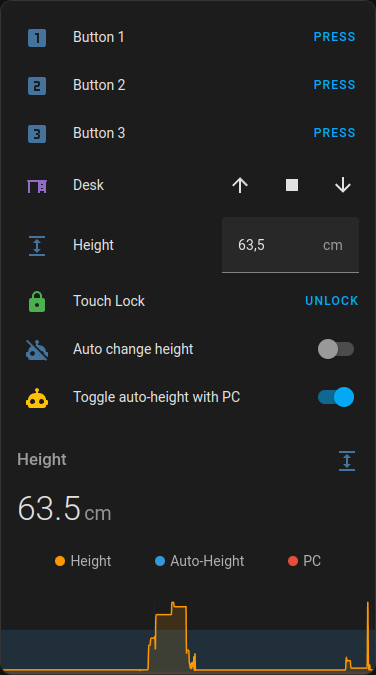

# Exeta Desk Controller (esphome)

Remote control your [Exeta motorized desk](https://exeta.de/) (in my case an
[ergoPRO 2019 Edition](https://amzn.eu/d/6zWSsSo)) over the network using esphome.

This works with an Arduino board reading the central control box signals and simulating button presses on the
controller.

For information on how to integrate this without esphome using platformio, look into the
[`legacy_platformio` directory](./legacy_platformio/). This was my implementation before switching to esphome and is not
actively maintained. It's only there as a reference.

## Compatibility

This code was written for the control panel CT01-CH and attaches directly to this. I'm not sure, if or how this should
be adapted to work with other Exeta desks/controllers or different brands of motorized desks.

It was also developed to be installed on a [WEMOS D1 Mini](https://www.az-delivery.de/products/d1-mini). Compatibility
with other boards is untested.

## Installation

### Physical connection

**_DISCLAIMER:_ Do this at your own risk and keep in mind that your are probably voiding your warranty. Me or my
instructions are not responsible for possible damages.** I just want to share my knowledge after modding my own desk.

Screw open your control unit (mine is a touch controlled one) and take out the PCB. Be careful to not accidentally cut a
wire

Connect your cables from the D1 Mini to the controller PCB by soldering them according to the schematic. **Do not
desolder anything**.


### Software installation

Copy the [`esphome/desk.yaml`](./esphome/desk.yaml) into your homeassistant `/config/esphome` directory. The
configuration uses the keys `wifi_ssid` and `wifi_password`, so make sure to add them to your `secrets.yaml`.

Install the code via esphome in your Homeassistant instance and import the device.

#### External Component

By default, the external component gets included from GitHub, so you don't need any more files. If you want to save the
component definition locally and/or modify it, you have to also download [`esphome/components/`](./esphome/components/)
and put it into your esphome directory. The use the local `external_components` source instead of the github one in your
`desk.yaml`.

## Remote Control

Control your desk using the entities created by your esphome integration for the new device.

Controlling the height via the `cover` and `number` is not very precise, because it essentially emulates holding the
up/down buttons until the display shows the desired height. But because the desk doesn't just stop dead, it cannot move
to the **exact** height. I tried to mitigate this a bit by stopping early, but because of varying move speed this still
only lands approximately at the target position.

Also, the **STOP** button of the cover really only works, if the desk moves by controlling it via the cover or number
input. When pressing one of the position memory keys the only way to stop the desk is by pressing on one of those again.
The actual controller does not have a dedicated **STOP** button, so there is nothing that could be pressed, but only to
release while emulating a press on Up/Down.

There may be edge cases, where pressing buttons while the desk is performing another task might result in unexpected
behaviour or altering what the controls do because of unexpected output state. I tried to mitigate this as much as
possible by resetting all output channels before performing a new action. But I cannot guarantee mashing buttons or
rapidly firing entity actions won't ever break something.

### Automations

I use these automations to force me to stand up every so often.

```yaml
# automations.yml

# ...

- id: '1666937325981'
  alias: '[Desk] auto change height'
  description: Switches the desk between sitting and standing every 30 minutes when the desk automation is enabled
  trigger:
    - platform: state
      entity_id:
        - sensor.desk_height
      for:
        hours: 0
        minutes: 30
        seconds: 0
      id: height_change
    - platform: state
      entity_id:
        - automation.desk_auto_change_height
      id: automation_changed
      for:
        hours: 0
        minutes: 30
        seconds: 0
  condition:
    - condition: or
      conditions:
        - condition: trigger
          id: height_change
        - condition: and
          conditions:
            - condition: trigger
              id: automation_changed
            - condition: template
              value_template:
                '{{ ((as_timestamp(now())-as_timestamp(states.sensor.desk_height.last_updated)) / 60) > 30 }}'
              enabled: true
  action:
    - if:
        - condition: numeric_state
          entity_id: sensor.desk_height
          above: 80
      then:
        - service: script.desk_move_down
          data: {}
      else:
        - service: script.desk_move_up
          data: {}
  mode: single
- id: '1666937511205'
  alias: '[Desk] toggle automation from pc state'
  description: Turn on desk automation when PC is turned on and vice versa
  trigger:
    - platform: state
      entity_id:
        - device_tracker.pc
      to:
  condition: []
  action:
    - if:
        - condition: state
          entity_id: device_tracker.pc
          state: home
      then:
        - service: input_boolean.turn_on
          data: {}
          target:
            entity_id: automation.desk_auto_change_height
      else:
        - service: input_boolean.turn_off
          data: {}
          target:
            entity_id: automation.desk_auto_change_height
  mode: single
# ...
```

The last automation uses an entity `device_tracker.pc` which tracks, if my PC is on (connected to the network) or not.
Replace this with your own device tracker or delete the automation if you don't want to use this.

### Lovelace

I use this card in my dashboard, to manually control the desk and automations, as well as viewing its state and history.

This card uses the [vertical-stack-in-card](https://github.com/ofekashery/vertical-stack-in-card),
[secondaryinfo-entity-row](https://github.com/custom-cards/secondaryinfo-entity-row),
[timer-bar-card](https://github.com/rianadon/timer-bar-card) and
[mini-graph-card](https://github.com/kalkih/mini-graph-card) custom components.



```yaml
# card.yaml

type: custom:vertical-stack-in-card
cards:
  - type: entities
    show_header_toggle: false
    entities:
      - entity: button.desk_mode_1
        name: Button 1
        icon: mdi:numeric-1-box
      - entity: button.desk_mode_2
        name: Button 2
        icon: mdi:numeric-2-box
      - entity: button.desk_mode_3
        name: Button 3
        icon: mdi:numeric-3-box
      - entity: cover.desk
      - entity: number.desk_height
        name: Height
        icon: mdi:arrow-expand-vertical
      - entity: lock.desk_input
        name: Touch Lock
      - entity: automation.desk_auto_change_height
        name: Auto change height
      - type: conditional
        conditions:
          - condition: state
            entity: automation.desk_auto_change_height
            state: 'on'
        row:
          type: custom:timer-bar-card
          entity: timer.next_desk_height_change
          name: Next height change
      - entity: automation.desk_toggle_automation_from_pc_state
        name: Toggle auto-height with PC
    state_color: true
  - type: custom:mini-graph-card
    entities:
      - entity: sensor.desk_height
        name: Height
      - entity: automation.desk_auto_change_height
        name: Auto-Height
        y_axis: secondary
        show_line: false
        show_points: false
        show_state: false
      - entity: device_tracker.pc
        y_axis: secondary
        show_line: false
        show_points: false
        show_state: false
    points_per_hour: 60
    hour24: true
    name: Height
    height: 120
    line_width: 2
    lower_bound: 62
    upper_bound: 128
    state_map:
      - value: not_home
        label: 'Off'
      - value: 'off'
        label: 'Off'
      - value: home
        label: 'On'
      - value: 'on'
        label: 'On'
```

## Schematics

Schematics can be found in [`doc/schematics/`](./doc/schematics).

I also took a few [photos of my own controller](./doc/photos) and the connected D1 Mini. Unfortunately I had the great
idea to secure my soldered wires with hot glue, so it is really hard to see whats soldered where. Also, I wired the RX
(Pin 4) to D5 instead of D6 on my own controller without realising it when creating the diagrams. But it's only
important, the Pin on the ESP is set as `rx_pin` in [`desk.yaml`](./esphome/desk.yaml).

I numbered the wires using my own method (nothing, the manufacturer intended or is using in a similar way). Starting
from the power pins, I simply counted from right to left. I'm using this numbering system in this documentation as well
as the code.

### Controller Signaling

The controller sends signals (`HIGH`) over the wires 5 to 8 on button press according to the following mapping:

| Button | Active Pins | HIGH Outputs |
| ------ | ----------- | ------------ |
| M      | 8           | D4           |
| 1      | 5           | D1           |
| 2      | 6 + 7       | D2 + D3      |
| 3      | 5 + 7       | D1 + D3      |
| Up     | 6           | D2           |
| Down   | 7           | D3           |

These pins are connected to the D1 Mini as `OUTPUT`. By setting them to `HIGH`, the board simulates a button press on
the controller.

Additionally, it receives SoftwareSerial (UART?) packages from the central control box via Pin 4 (`SoftwareSerial` RX)
with a baud rate of `9600`. TX is unused. To use this information on the D1 mini, the RX wire is connected as `INPUT` on
the D1 Mini and configured as `SoftwareSerial` RX pin.

Pin 1 and 2 are used for 5V power.

I did not check (or forgot) what pin 3 does. But it is not needed to control the desk.
